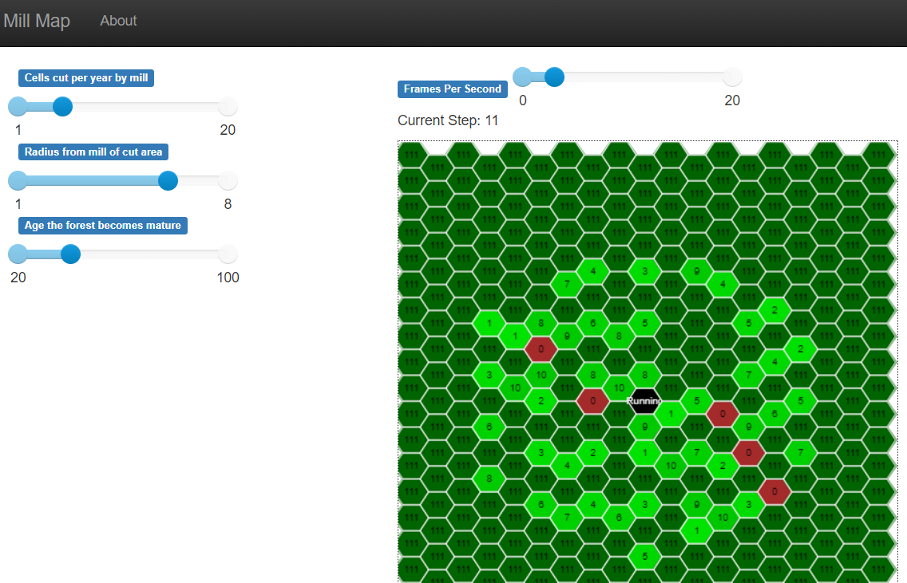

# Devlog Week 7

This Digital History project will be an agent-based simulation of charcoal production in the forests of the eastern United States 1700-1945. I would like to use this to explore the scale of labour involvement and to simulate the pattern of construction of charcoal hearths to compare it to the archaeological record. For comparison, I plan to use the area surrounding either [Catoctin Furnace, Maryland](https://www.nps.gov/cato/learn/historyculture/furnace.htm) or [Hopewell Furnace, Pennsylvania](https://www.nps.gov/hofu/index.htm). 

For this project, I selected [Mesa](https://mesa.readthedocs.io/en/stable/index.html), an agent-based modelling framework for python. I'll write more about my choices in the paradata document.

I set up Mesa and made a prototype model. I wanted to make a simple model as a basis for a more developed model to investigate charcoal production. For the prototype, I modelled a saw mill that is situated in the middle of the forest and consumes trees from surrounding areas of land. It's not based on historical data, just a basic concept of a tree logging cycle. Here is [documentation](https://jeffblackadar.github.io/hist5706_digital_history/doc_mill.html).

(Above: The saw mill model running. Each cell shows the age of the forest. Brown cells have just been logged.)

## Bug seen above

Once I posted this I looked at the screen shot again and saw green forest cell with age 0 - not correct. I was setting state and setting color in the wrong order. It's a good part of the process that I take a second look when posting this to be read.

I also laid out some structure for documentation. I want to explain how the model works, but have the code be part of that. I'm being more rigourous that usual commenting code so I can export comments into programming class diagrams using [Mermaid](https://mermaid-js.github.io/mermaid/#/classDiagram), a "Markdown-inspired" diagram tool.
