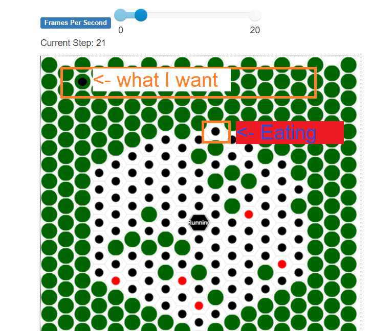
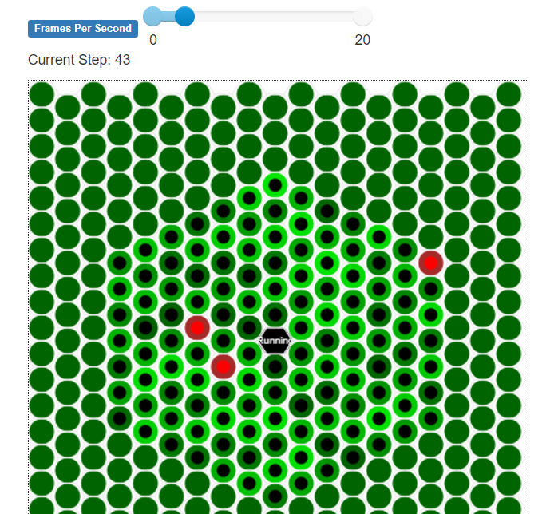

# Devlog Week 8 Details

# Revamp Mill to Furnace
I've changed the Mill class to Furnace class.  MillMap is now CharcoalProductionMap

# Agents eating each other

  
It is necessary to modify HexGrid to inherit from MultiGrid to have 2 agents in the same place

(Above: Agents eating other agents)

Per this post: https://github.com/projectmesa/mesa/issues/878, a grid needs to be able to store more than 1 agent at an X,Y position. Hexgrid stores only 1 agent at an X,Y. Should I modify Mesa? I decided to avoid modifying Mesa itself. I made a copy of the space.py file that has Grid, HexGrid and MultiGrid classes in it. I made a new HexGridMulti(MultiGrid) class. HexGridMulti inherits from MultiGrid. MultiGrid, as per its name, allows multiple agents to occupy the same position on a grid. Below it's working. A challenge now is to keep charcoal hearths unique.

(Above: Multiple agents can now occupy same position in same grid)

