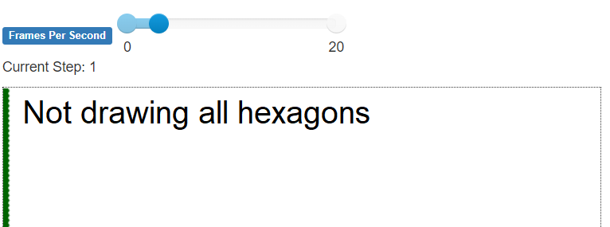
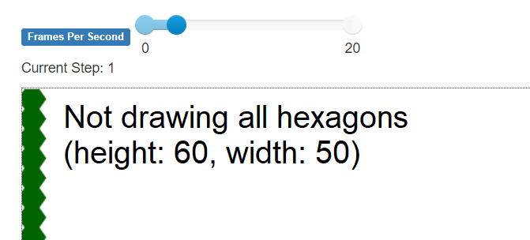
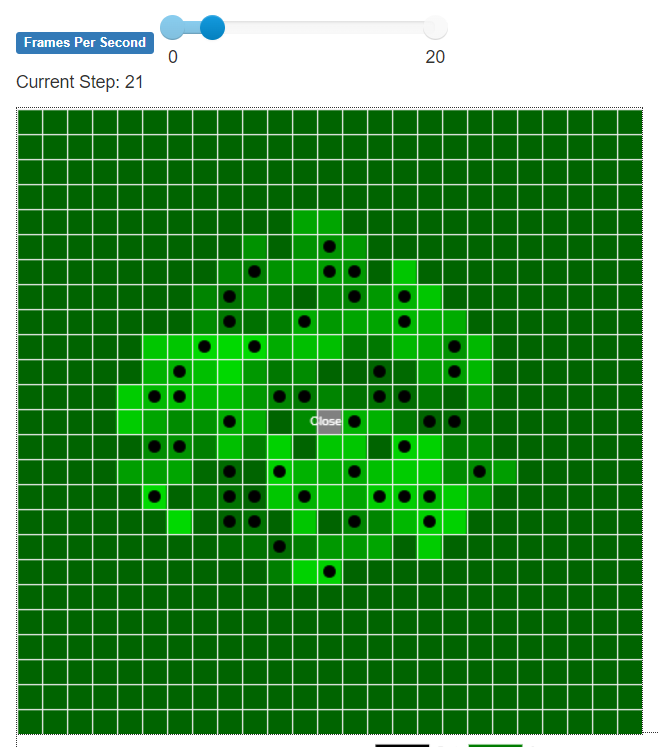
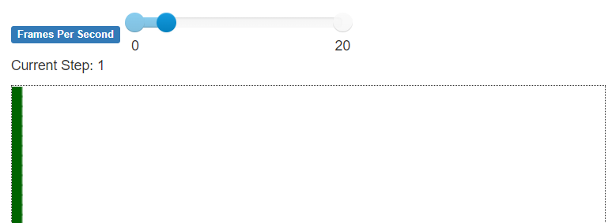
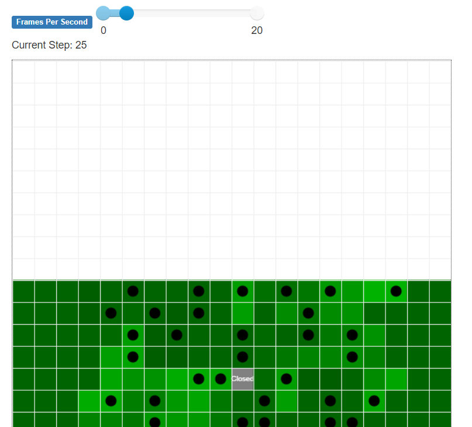
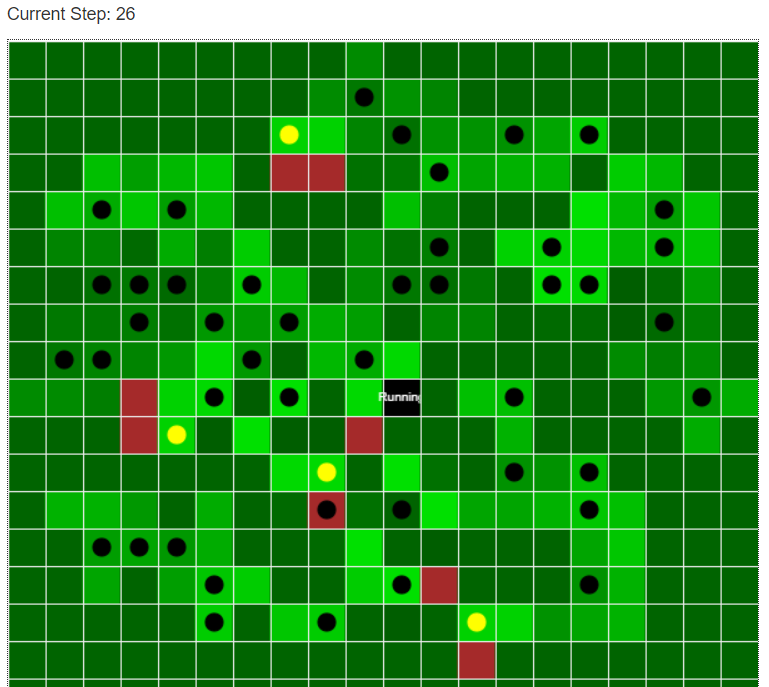
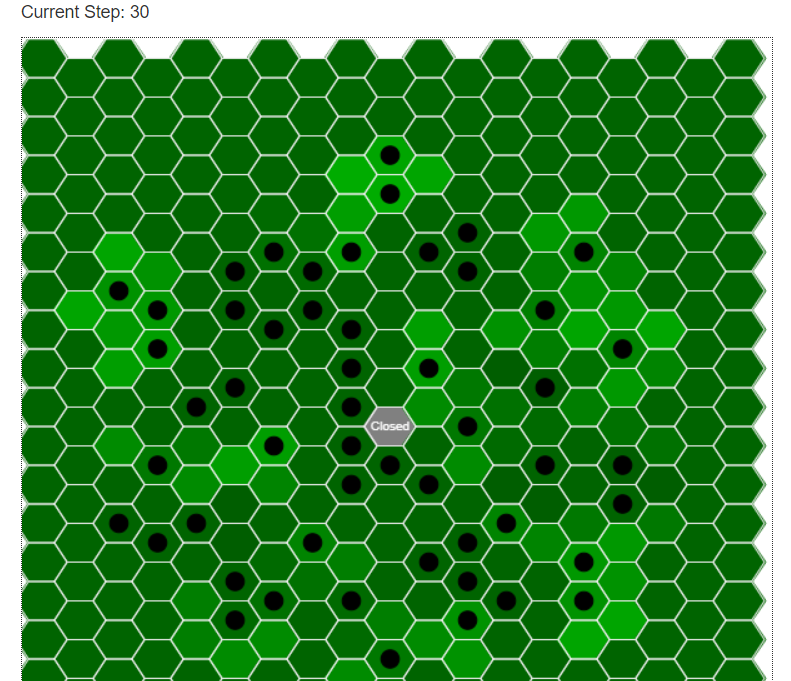

# Devlog 2 Week 9
TL;DR: During this week I added a new agent type for the charcoal hearth itself. I had to modify Mesa in order to have both a charcoal hearth and a land cell agent occupy the same coordinate on a hexagonal grid. I did further research on the historical basis of the model and attempted to scale it to a 12,000 acre "iron plantation" but the visualization is failing.

## Adding an independent agent for charcoal hearths
Over the past two weeks I've been working on refining how the agent-based model works for charcoal hearths and adding a historical basis to it. Refininging the model meant adding a class for a charcoal hearth itself. An area of forest (a land cell) is one agent whose state changes as it matures or is logged. A charcoal hearth, while located in an area of forest, has its own behaviour and states. A hearth is built, then fired and then becomes relict when it may be reused. I added separate charcoal hearth agents, but when I did it replaced the area of forest it was located on, like in the picture below. There is more detail [here](dev_log_1_week_8_detail.md), but to summarize, Mesa's HexGrid needed to be modified to allow two different agents (a land cell and a charcoal hearth) to occupy the same coordinate on the grid.

(Above: Agents eating other agents)

## Historical basis and scaling

### To make charcoal using a hearth, the wood from one acre of mature forest is required.
Part of this simulation is visulize how a forest was consumed for charcoal production and what patterns of charcoal hearth contruction occured. Understanding how much wood is required to construct a charcoal hearth and how much land is required to produce the wood is fundamental to the simulation. At the same time, I am forced to generalize. The size of charcoal hearths can vary, likely due to the amount of available wood, but they do fall within a range. Constructing a charcoal hearth requires roughly 30 cords of wood.

I don't have my paternal grandfather's deep knowledge of forestry or logging, but I do know based on reading, observation and some information from him, different areas of forests produce more wood and regenerate faster than others. However, I will use a generalization that an acre produces 30 cords of wood usable for making charcoal. (Rolando, “19th-Century Charcoal Production in Vermont"). Having never cut firewood, I am going to test this figure more based on research to see if it makes sense.

I will base this model on the calcuation that 1 acre of mature forest produces 30 cords of wood (~108 cubic meters) (1 cord = 3.6 cubic meters / 4 X 4 X 8 feet, 128 cubic feet) and producing a load of charcoal from a hearth requires 30 cords of wood. I am using Imperial measurement units here because they were the units used for construction at the time and are more convertable for the purposes of the model. Measurements relating to the archaeological record will be in Metric. This generalization may seem too tidy, one acre of wood produces enough wood to construct a charcoal hearth. Loggers would not have marked out an acre area and then logged it. They logged what wood was available and then piled it for use. It is likely loggers would have logged enough wood to construct a charcoal hearth (30 cords) and would have been paid per cord logged. Since a logging of 30 cords of wood would consume trees from an acre of land, assuming cutting all trees with a trunk diameter of more than 2.5 cm or 1 inch, this supports a generalization that 1 acre of mature forest was required to produce a load of charcoal from a hearth. A less productive area of forest may have required more area to produce enough wood or else a smaller hearth may have been constructed. The reverse would be true for very productive woodlands, however, productivity would average over a large area.

### Iron Plantation - 12,000 acres
One historical example of a charcoal heated iron furnace describes its use of 600 acres of forest to make charcoal each year. Over a 20 year cycle of cutting and regrowth, an area of 12,000 acres would be used. I expanded the model to have 12,000 cells in a grid of 120 x 100. The visualization breaks as in the figure below.

Above: Hexagonal grid 120 X 100

I tried some smaller grid sizes, but there were problems with them too:

Above: Hexagonal grid 60 X 50

I converted to a rectangular grid. I prefer a hexagonal grid which seems more reflective of a pattern of harvesting wood and accumulating it at a central point. My hypothesis is that the logging would likely occur in a circular harvest area that would become roughly hexagonal as trees at the edges of circular logging areas were consumed. The pattern of harvest was to clearcut, but I would imagine loggers would work efficiently to travel the least distance from logged trees to where they would be piled. This does not take into account variations due to barriers in terrain, use of animal power to haul wood or roads.

Above: Rectangular grid 25 X 25

However, the rectangular grid did not scale well:

Above: Rectangular grid 120 X 100

Even with a height of 30 the visualization had a problem:

Above: Rectangular grid 30 X 20

I'm not sure why this is the case. I'll research this. I think I am stuck with limiting the modelling within 20 X 20 because even using a harvest radius of 8 cells from the furnace, the model steps very slowly. I should have done some earlier experimentation with scaling to larger grids. perhaps Netlogo handles this better? Perhaps I have an error in how I process model steps with too much looping? Perhaps I could look at how grids are stored in Mesa to see if there is a more efficient structure. (It's highly, highly unlikely I could improve this.) I do think I could model on a scale of 12,000 cells without using the visualization, but to just plot results for each step/year of the model. I could also model on a smaller area as a proxy for what would happen in a larger forest.

Here is a working model with a rectangular grid.

Above: Rectangular grid 20 X 20

Here is a working model with a hexagonal grid.

Above: Hexagonal grid 20 X 20

