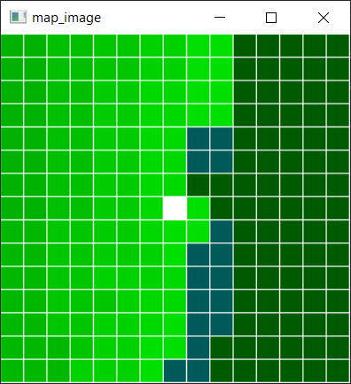
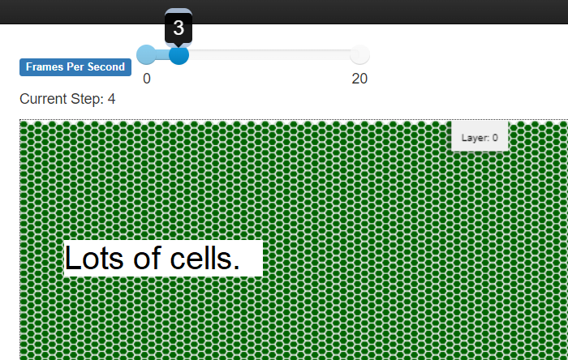
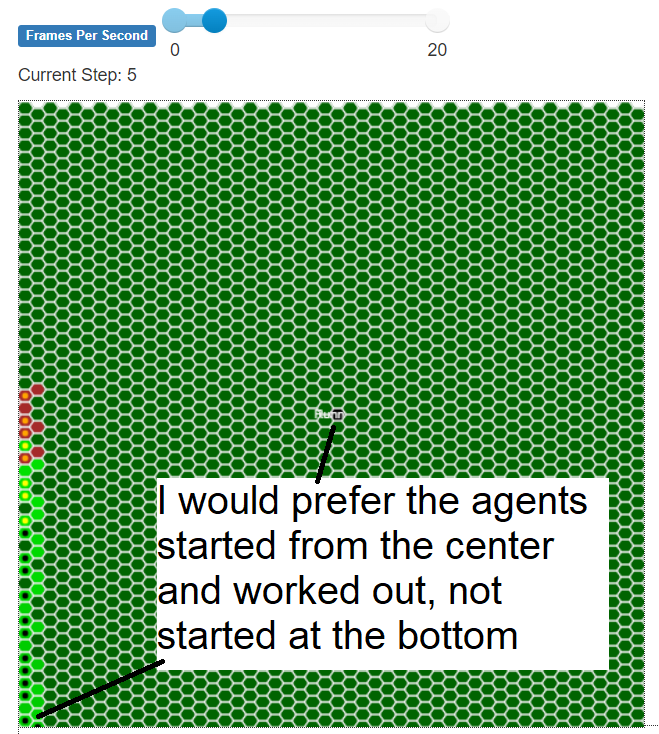
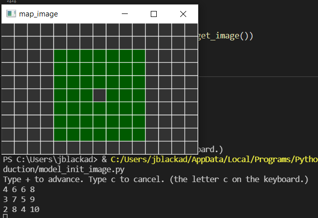

# Devlog Week 10

---
tutorial: Mesa ABM with Python
date: 2021 Nov 25
tags: hist5706, Mesa, Python
---

The first two sections of the dev log describe two explorations I did that I won't use. Sometimes this happens to me. I spend a good amount of time on something and it turns out, if I knew better, I shouldn't have invested the time. But it's part of the process and sometimes I recycle something from this later.

## Mesa not Scaling? No, just a fatal mistake by me.

In [Dev Log 2](dev_log_2_week_9.md), I described my concern Mesa would not scale in the web browser visualization. No problem, I decided to make an image based visualization. The program I made is [server_image.py](https://github.com/jeffblackadar/hist5706_digital_history/blob/main/charcoalproduction/server_image.py). When running it, press + to step the model and c to cancel.

below: An image based visualization using OpenCV to represent land cells of the model. 



However, my concern about not scaling was misplaced. As I worked on my new image visualization, I had some odd behaviour with the height and width of the model. Troubleshooting this showed I was mixing up height and width when I called the model. This is the root of the problem about not scaling. Once I fixed this, Mesa works fine.  I did not see it before because I was using equal values for height and width. But, if needed, I now have a recipe to visualize a Mesa model using an image.

below: Mesa works fine with a lot of cells.



## Agents starting work from the center

I would prefer agents start work from the center and move to the edges. It seems more natural that cutting wood for charcoal would happen near the furnace first. At first, my models worked this way, but as they grew larger, they became slower. I had been using self.neighbors_outer(self.collection_radius) to get the cells within a set radius of the furnace. When the radius was above 7, the loop to find cells of mature forest to cut for charcoal became much longer and slower. It wasn't going to work for a model that was 50 cells wide. 

```
for neighbor in self.neighbors_outer(self.collection_radius)
```

I shifted to using for cell_list in self.model.grid.__iter__(): It's far faster. Also it iterates over all of the cells rather than what is inside a radius from the furnace. This fits better with a model where a furnace would exploit all of the forest in its iron plantation, which I assume is closer to a rectangle in shape than a circle.

```
for cell_list in self.model.grid.__iter__():
```

A side effect was that the agents start from the bottom left, like below:



No problem! Cells are stored in the model using an x, y loop in model.py

```
        for (contents, x, y) in self.grid.coord_iter():
            if(not (x==width // 2 and y==height // 2)):
                land_cell = LandCell((x, y), self)
                self.grid.place_agent(land_cell, (x, y))
                self.schedule.add(land_cell)
```

I thought if I stored the cells the cells in order from the center outwards, when I iterated through them, I would iterate in that order. So I worked on a routine to add the cells from the center outwards. This "logic" was going to be a bit complicated so I made a seprate smaller program to work out the kinks. [model_init_image.py](https://github.com/jeffblackadar/hist5706_digital_history/blob/main/charcoalproduction/model_init_image.py)  I recycled some of my image work from the previous experiment to make an image visualization, like below.

Below, model_init_image.py showing agents being added from the center outwards:



But... 
```
for cell_list in self.model.grid.__iter__(): 
```
...ignores the order cells are added.  I could have read up about this behaviour before programming this and thinking about it. I will stick with agents starting from the bottom left. While it does not fit my preference of starting from the center, it will reflect a pattern of land usage and construction of charcoal hearths over time, since all areas of forest were consumed for charcoal over cycles of twenty years.

Now, I am concentrating on documentation using [Mermaid](https://mermaid-js.github.io/mermaid/#/) a Markdownish diagram tool. Documentation is taking shape [here](doc_charcoalproduction.html). This week I've added a legend for symbols that appear in the simulation. I will do to work on the paradata, run simulations and tune the model. I plan to allow for variation to reflect my lack of certainty of aspects of production of charcoal as well as local factors such as forest productivity, skill and techniques of colliers and loggers.